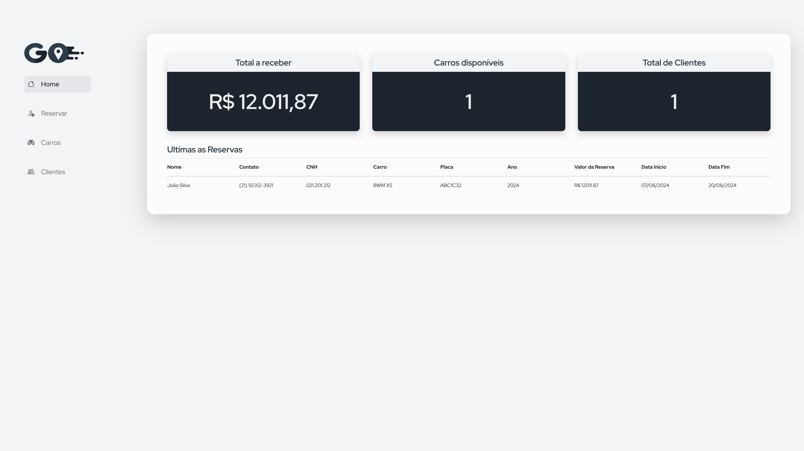
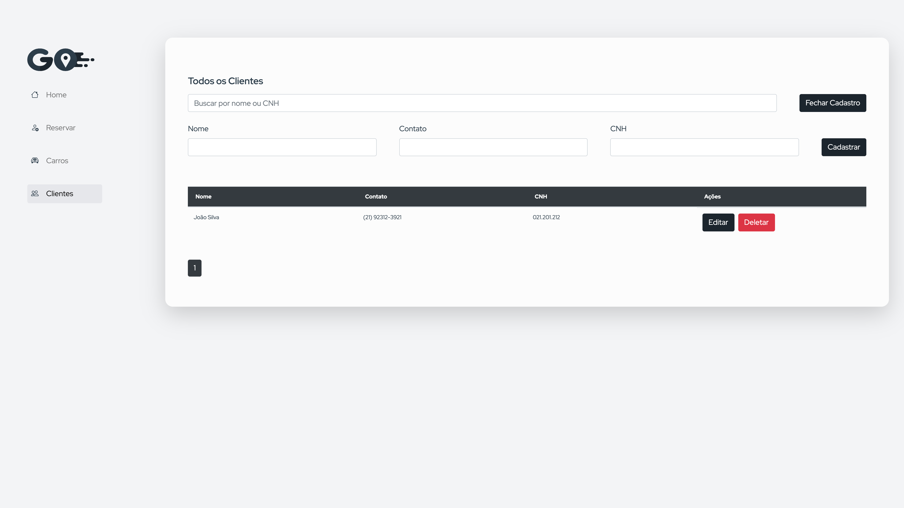
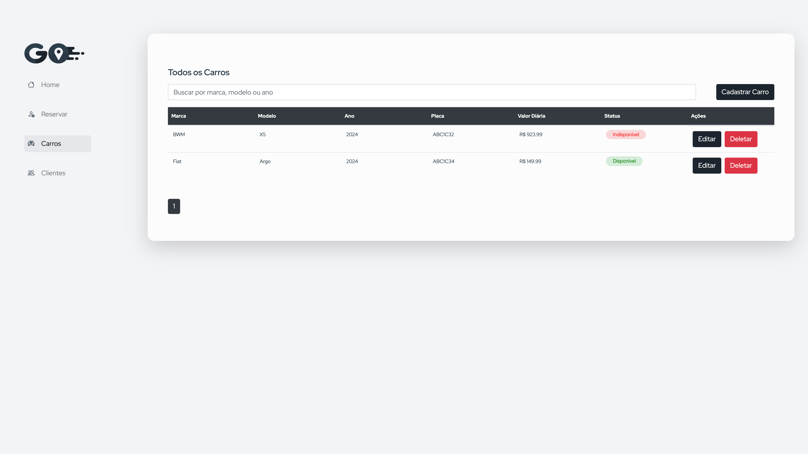
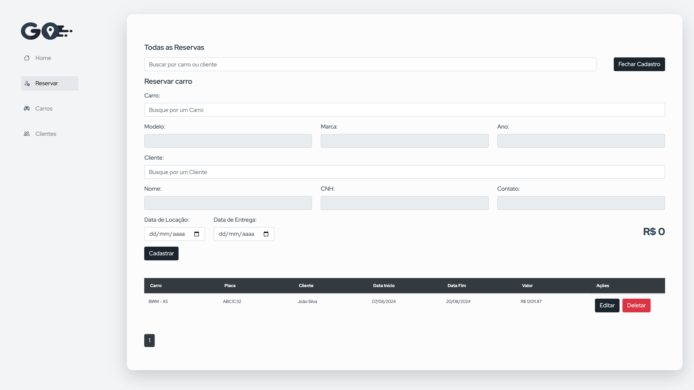

# Sistema de Reservas de Carros

Este é um sistema completo de reservas de carros, que inclui um frontend desenvolvido com React e um backend em C#. O sistema permite a gestão de clientes, carros e reservas, além de suportar operações de cadastro, edição e exclusão.

## Tecnologias Utilizadas

### Frontend
- **React**: Biblioteca JavaScript para construção de interfaces de usuário.
- **TypeScript**: Superset de JavaScript que adiciona tipagem estática.
- **React Bootstrap**: Biblioteca de componentes UI para React.
- **jQuery**: Biblioteca JavaScript para manipulação do DOM e validação de formulários.

### Backend
- **C#**: Linguagem de programação utilizada para o desenvolvimento do backend.
- **ASP.NET Core**: Framework para criação de APIs RESTful.

## Configuração do Projeto

### Backend

1. Navegue até o diretório do backend.
2. Abra o arquivo `appsettings.json` e configure a string de conexão do banco de dados.
3. Compile e execute o projeto usando o comando:
   ```bash
   dotnet run
   ```

### Frontend

1. Navegue até o diretório do frontend.
2. Instale as dependências do projeto com o comando:
   ```bash
   npm install
   ```
3. Execute o projeto com o comando:
   ```bash
   npm start
   ```

## Endpoints da API

### Carro

- **GET** `/api/Carro/BuscarCarros`  
  Obtém a lista de todos os carros.

- **GET** `/api/Carro/BuscarCarroPorId/{carroId}`  
  Obtém um carro específico pelo ID.

- **POST** `/api/Carro/CriarCarro`  
  Cria um novo carro.

- **PUT** `/api/Carro/EditarCarro`  
  Atualiza um carro existente.

- **DELETE** `/api/Carro/RemoverCarro`  
  Remove um carro.

### Cliente

- **GET** `/api/Cliente/BuscarClientes`  
  Obtém a lista de todos os clientes.

- **GET** `/api/Cliente/BuscarClientePorId/{clienteId}`  
  Obtém um cliente específico pelo ID.

- **POST** `/api/Cliente/CriarCliente`  
  Cria um novo cliente.

- **PUT** `/api/Cliente/EditarCliente`  
  Atualiza um cliente existente.

- **DELETE** `/api/Cliente/RemoverCliente`  
  Remove um cliente.

### Reserva

- **GET** `/api/Reserva/BuscarReservas`  
  Obtém a lista de todas as reservas.

- **GET** `/api/Reserva/BuscarReservaPorId/{reservaId}`  
  Obtém uma reserva específica pelo ID.

- **GET** `/api/Reserva/BuscarPorIdCliente/{clienteId}`  
  Obtém reservas de um cliente específico pelo ID.

- **GET** `/api/Reserva/BuscarPorIdCarro/{carroId}`  
  Obtém reservas de um carro específico pelo ID.

- **POST** `/api/Reserva/CriarReserva`  
  Cria uma nova reserva.

- **PUT** `/api/Reserva/EditarReserva`  
  Atualiza uma reserva existente.

- **DELETE** `/api/Reserva/RemoverReserva`  
  Remove uma reserva.

## Estrutura do Projeto

### Frontend
- `src/Components/Cliente` - Componentes relacionados à gestão de clientes.
- `src/Components/Carro` - Componentes relacionados à gestão de carros.
- `src/Components/Reserva` - Componentes relacionados à gestão de reservas.
- `src/Interfaces` - Definições de tipos TypeScript para clientes, carros e reservas.
- `src/services/api.ts` - Configuração da API.

### Backend
- `Controllers` - Controladores que gerenciam as requisições da API.
- `Models` - Modelos de dados e entidades.
- `Data` - Contexto de dados e inicialização do banco de dados.
- `Startup.cs` - Configuração e inicialização do aplicativo.

## Capturas de Tela

### Página Inicial



### Cadastro de Cliente



### Cadastro de Carro



### Gerenciamento de Reservas



## Contribuição

Se desejar contribuir com o projeto, siga estas etapas:

1. Faça um fork do repositório.
2. Crie uma nova branch para sua funcionalidade ou correção:
   ```bash
   git checkout -b minha-nova-funcionalidade
   ```
3. Faça suas alterações e commit:
   ```bash
   git commit -am 'Adiciona nova funcionalidade'
   ```
4. Envie suas alterações para o repositório remoto:
   ```bash
   git push origin minha-nova-funcionalidade
   ```
5. Abra um pull request para revisão.